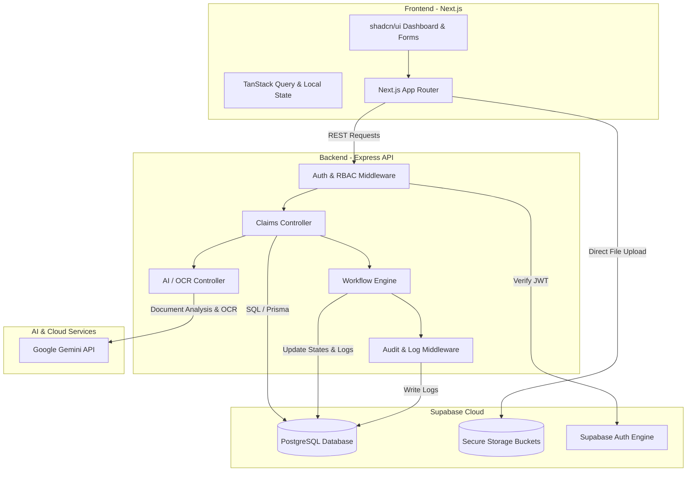

# Police Medical Claims Intelligence & Transparency System (PMCITS)
# 03. Module Breakdown

This document describes the software architecture, folder layouts, and component breakdowns for the PMCITS project.

---

## 1. System Architecture Diagram



---

## 2. Directory Structure

To align with `Build_Steps.md`, the codebase is divided into three primary roots: `frontend/`, `backend/`, and `database/`.

```text
pmcits/
├── database/
│   ├── schema.sql             # SQL definitions for tables, types, and indexes
│   ├── rls_policies.sql       # Row Level Security configuration
│   ├── seed_data.sql          # Seed data for hospitals, doctors, CGHS tariffs
│   └── reset.sql              # Clean and rebuild script
│
├── backend/
│   ├── src/
│   │   ├── config/            # Supabase config, Gemini config, Environment vars
│   │   ├── controllers/       # Route request handlers (auth, claims, workflow, admin)
│   │   ├── middlewares/       # JWT auth validation, role RBAC checks, audit log recorders
│   │   ├── models/            # TypeScript type schemas and Zod request body schemas
│   │   ├── routes/            # Express router setups mapping URLs to controllers
│   │   ├── services/          # Business logic: AI analysis, notification delivery, audit service
│   │   └── index.ts           # Server entry point
│   ├── package.json
│   └── tsconfig.json
│
└── frontend/
    ├── src/
    │   ├── app/               # Next.js page routing (dashboard, claims, login, reports)
    │   ├── components/        # Reusable UI (ui/ components, claim form, timeline viewer)
    │   ├── hooks/             # TanStack queries, mutations, custom hooks
    │   ├── lib/               # API clients, Supabase client initialization, utils
    │   └── context/           # Global user authentication context
    ├── tailwind.config.js
    ├── package.json
    └── tsconfig.json
```

---

## 3. Module Specifications

### A. Authentication & RBAC Module
*   **Location:** `backend/src/middlewares/auth.ts`, `frontend/src/context/AuthContext.tsx`
*   **Description:** Intercepts incoming backend requests, decodes the Supabase JWT header, determines the user’s role, and compares it against the resource permissions list.
*   **Key Operations:**
    *   Validate Bearer token.
    *   Verify active user state from the database context.
    *   Enforce endpoints access based on RBAC rules.

### B. Claims Submissions & Workflow Module
*   **Location:** `backend/src/services/workflow.ts`, `backend/src/controllers/claims.controller.ts`
*   **Description:** Manages the claim lifecycle states. It acts as a finite state machine, verifying if transitions are valid (e.g., you cannot jump from `Submitted` to `Paid` directly without approvals).
*   **Key Operations:**
    *   Evaluate inputs and record new claim instances as `Draft` or `Submitted`.
    *   Verify state jumps and block unauthorized transitions.
    *   Update historical records in `workflow_history` and trigger notifications on updates.

### C. AI Document Analysis Module
*   **Location:** `backend/src/services/ai.service.ts`
*   **Description:** Receives uploaded document URLs, extracts information via Google Gemini API, performs validations (duplicate checks, invoice totals sums vs. database inputs, missing documents matching), and writes analysis records.
*   **Key Operations:**
    *   Extract structured texts from documents via Gemini Multi-modal input.
    *   Execute duplicate billing detection scans against historical DB tables.
    *   Compile overall Risk Score assessments.

### D. Secure Storage & Document Viewer Module
*   **Location:** `backend/src/controllers/documents.controller.ts`
*   **Description:** Obtains secure upload authorization from Supabase Storage and serves encrypted files by generating limited-duration SAS (Shared Access Signature) pre-signed URLs.
*   **Key Operations:**
    *   Secure write/read authorizations.
    *   Create pre-signed download URLs.

### E. Notification Dispatcher Module
*   **Location:** `backend/src/services/notification.service.ts`
*   **Description:** Sends in-app signals (websockets / Supabase realtime channel updates) and schedules emails/SMS updates on critical workflow transitions.
*   **Key Operations:**
    *   Register and broadcast alerts to specified user channels.
    *   Formulate email templates containing specific claim URL references.
