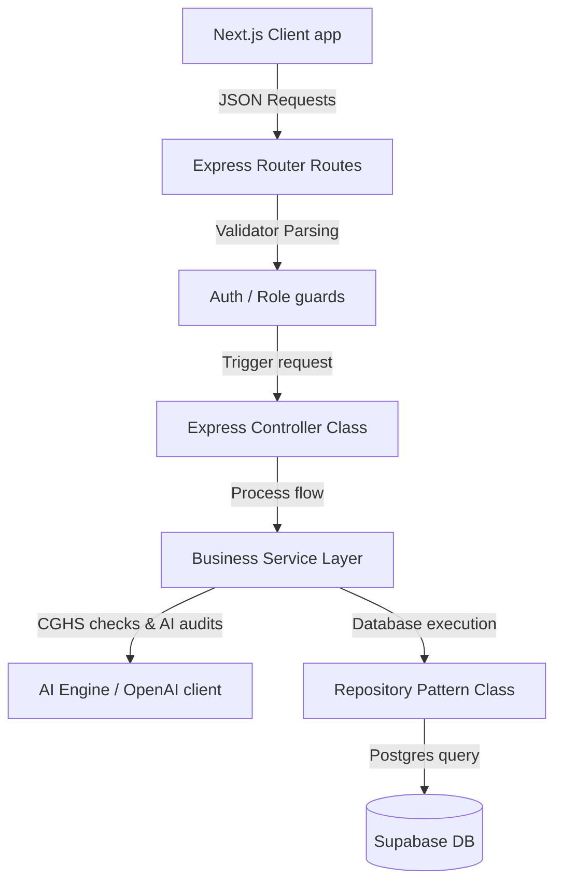

# Developer Guide - PMCITS Project

This guide provides technical reference patterns, folder code styles, and architectures designed for developers extending the Police Medical Claims portal.

---

## 1. Architectural Patterns

The system implements a strict multi-tier architecture, isolating database access layer operations, business limits checking, and routing handlers:



### A. Repository Pattern
All SQL operations interact through repository classes located in `backend/src/repositories/`. No SQL query string or Supabase client execution should take place inside the routes or controllers.
Example structure:
```typescript
import { supabaseAdmin } from '../config/supabase';

export class ExampleRepository {
  async getRecord(id: string) {
    return supabaseAdmin.from('records').select('*').eq('id', id).single();
  }
}
```

### B. Service Layer
The service layer (`backend/src/services/`) holds workflow rules, hospital calculations, and CGHS limits checks. Service classes delegate db read/writes to repositories.

---

## 2. API Validation and Coding Style

### Request Validations
All controller routers parse incoming parameters against Zod schema definitions (`backend/src/validators/`).
*   **Rules**: Never trust parameters or query arguments. Check bounds, formats, and dates in the Zod interceptor.
*   **Response Format**: Ensure every endpoint responds with a standardized structure:
    ```json
    {
      "success": true,
      "data": { ... }
    }
    ```
    If error occurs:
    ```json
    {
      "success": false,
      "error": {
        "message": "Detailed error summary",
        "code": "ERROR_CODE"
      }
    }
    ```

---

## 3. Extending the System

### Adding a New Workflow Stage
1.  **State Mappings**: Add the status to the `VALID_TRANSITIONS` registry in [claim.service.ts](file:///c:/Users/lenovo/Desktop/AI-Learning/pmcits/backend/src/services/claim.service.ts).
2.  **Role Verification**: Map allowed execution roles to the RBAC validator array inside the claims router [claim.routes.ts](file:///c:/Users/lenovo/Desktop/AI-Learning/pmcits/backend/src/routes/claim.routes.ts).
3.  **Audit Recording**: Verify that any update invokes `claimRepo.writeAuditLog(...)` and `claimRepo.addWorkflowHistory(...)` to maintain transparency.
4.  **Notifications Hooks**: Add a custom event case under the workflow triggers switcher in [notification.service.ts](file:///c:/Users/lenovo/Desktop/AI-Learning/pmcits/backend/src/notifications/notification.service.ts).
